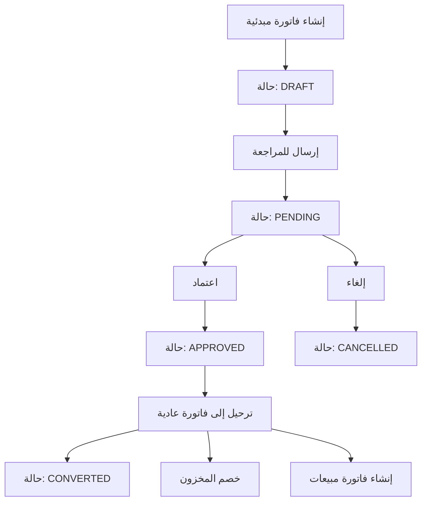

# 🎉 نظام الفواتير المبدئية - مكتمل بالكامل

## 📋 نظرة عامة

تم إنشاء **نظام شامل ومتكامل للفواتير المبدئية** في CeramiSys يوفر إدارة كاملة للفواتير المبدئية من الإنشاء حتى الترحيل إلى فواتير مبيعات عادية.

## ✅ الميزات المكتملة

### 🗄️ قاعدة البيانات
- **جدول ProvisionalSale**: الفواتير المبدئية الرئيسية
- **جدول ProvisionalSaleLine**: بنود الفواتير المبدئية  
- **enum ProvisionalSaleStatus**: حالات الفاتورة (DRAFT, PENDING, APPROVED, CONVERTED, CANCELLED)
- **علاقات كاملة**: مع الشركات والعملاء والمنتجات والمبيعات

### 🔧 Backend API
- **DTO Layer**: تعريف البيانات مع Zod validation (مُصلح بالكامل)
- **Service Layer**: منطق العمل والعمليات المعقدة
- **Controller Layer**: معالجة الطلبات والاستجابات
- **Routes**: مسارات API كاملة ومنظمة
- **TypeScript**: جميع الأخطاء مُصلحة

### 🎨 Frontend Interface
- **Redux API Slice**: تكامل كامل مع Redux Toolkit Query
- **صفحة رئيسية**: عرض وإدارة الفواتير المبدئية
- **مودال الإنشاء**: إضافة فواتير جديدة مع اختيار المنتجات
- **Navigation**: رابط في الـ sidebar للوصول السريع
- **تصميم متسق**: يتبع نفس نمط المشروع

## 🔄 مسار العمل (Workflow)



## 🛠️ الملفات المنشأة

### Backend Files
```
📁 server/
├── 📁 src/
│   ├── 📁 dto/
│   │   └── 📄 provisionalSalesDto.ts        # DTOs مع Zod validation
│   ├── 📁 services/
│   │   └── 📄 ProvisionalSalesService.ts    # منطق العمل
│   ├── 📁 controllers/
│   │   └── 📄 ProvisionalSalesController.ts # معالجة الطلبات
│   └── 📁 routes/
│       └── 📄 provisionalSalesRoutes.ts     # مسارات API
├── 📄 test-provisional-sales.js             # اختبارات API
└── 📁 prisma/
    └── 📄 schema.prisma                     # تحديث قاعدة البيانات
```

### Frontend Files
```
📁 client/
├── 📁 src/
│   ├── 📁 state/
│   │   └── 📄 provisionalSalesApi.ts        # Redux API slice
│   ├── 📁 app/
│   │   ├── 📄 redux.tsx                     # تحديث Redux store
│   │   ├── 📁 provisional-sales/
│   │   │   └── 📄 page.tsx                  # الصفحة الرئيسية
│   │   └── 📁 (components)/
│   │       └── 📁 Sidebar/
│   │           └── 📄 index.tsx             # تحديث Navigation
│   └── 📁 components/
│       └── 📁 provisional-sales/
│           └── 📄 CreateProvisionalSaleModal.tsx # مودال الإنشاء
```

### Documentation Files
```
📁 docs/
├── 📄 PROVISIONAL_SALES_SYSTEM.md           # توثيق النظام
├── 📄 PROVISIONAL_SALES_QUICK_START.md      # دليل البدء السريع
├── 📄 ZOD_SCHEMA_FIXES.md                   # إصلاحات Zod
├── 📄 FRONTEND_COMPLETION_SUMMARY.md        # ملخص الفرونت إند
└── 📄 PROVISIONAL_SALES_COMPLETE_SYSTEM.md  # هذا الملف
```

## 🔗 API Endpoints

| Method | Endpoint | الوصف |
|--------|----------|--------|
| `GET` | `/api/provisional-sales` | قائمة الفواتير مع البحث والفلترة |
| `POST` | `/api/provisional-sales` | إنشاء فاتورة مبدئية جديدة |
| `GET` | `/api/provisional-sales/:id` | الحصول على فاتورة واحدة |
| `PUT` | `/api/provisional-sales/:id` | تحديث فاتورة مبدئية |
| `DELETE` | `/api/provisional-sales/:id` | حذف فاتورة مبدئية |
| `PATCH` | `/api/provisional-sales/:id/status` | تغيير حالة الفاتورة |
| `POST` | `/api/provisional-sales/:id/convert` | ترحيل إلى فاتورة عادية |

## 📊 حالات الفاتورة

| الحالة | الوصف | الإجراءات المتاحة |
|--------|--------|-------------------|
| **DRAFT** | مسودة | تعديل، إرسال للمراجعة، حذف |
| **PENDING** | معلقة للمراجعة | اعتماد، إلغاء |
| **APPROVED** | معتمدة | ترحيل إلى فاتورة عادية |
| **CONVERTED** | مرحلة | عرض فقط (مرتبطة بفاتورة عادية) |
| **CANCELLED** | ملغية | عرض فقط |

## 🎯 الميزات الرئيسية

### 📝 إدارة الفواتير المبدئية
- ✅ إنشاء فواتير مبدئية دون التأثير على المخزون
- ✅ إضافة منتجات متعددة مع الكميات والأسعار
- ✅ ربط بالعملاء أو إنشاء عملاء جدد
- ✅ إضافة ملاحظات وأرقام فواتير مخصصة

### 🔄 مسار الموافقة
- ✅ نظام حالات متدرج ومنظم
- ✅ تحكم في الصلاحيات حسب الحالة
- ✅ منع التعديل بعد الترحيل

### 🏪 ترحيل آمن
- ✅ تحويل الفاتورة المبدئية إلى فاتورة مبيعات عادية
- ✅ خصم المخزون عند الترحيل فقط
- ✅ ربط الفاتورتين ببعضهما
- ✅ منع الحذف بعد الترحيل

### 🔍 بحث وفلترة متقدمة
- ✅ البحث بالنص في جميع الحقول
- ✅ فلترة بالحالة والشركة والعميل
- ✅ ترتيب بالتاريخ والمبلغ ورقم الفاتورة
- ✅ صفحات متعددة مع تحكم في عدد النتائج

### 👥 إدارة العملاء
- ✅ عرض قائمة العملاء الموجودين
- ✅ إضافة عملاء جدد من داخل النظام
- ✅ ربط الفواتير بالعملاء أو تركها نقدية

## 🚀 كيفية الاستخدام

### 1. تطبيق Migration
```bash
cd server
npx prisma migrate dev --name add-provisional-sales
```

### 2. تشغيل الخادم
```bash
# Backend
cd server
npm run dev

# Frontend  
cd client
npm run dev
```

### 3. الوصول للنظام
- افتح المتصفح على `http://localhost:3000`
- اذهب إلى "الفواتير المبدئية" من القائمة الجانبية
- ابدأ بإنشاء فاتورة مبدئية جديدة

## 🔧 التخصيص والتطوير

### إضافة حقول جديدة
1. تحديث `schema.prisma`
2. تحديث DTOs في `provisionalSalesDto.ts`
3. تحديث الخدمة والمتحكم
4. تحديث واجهة المستخدم

### إضافة حالات جديدة
1. تحديث `ProvisionalSaleStatus` enum
2. تحديث منطق العمل في الخدمة
3. تحديث واجهة المستخدم لدعم الحالات الجديدة

### تخصيص التقارير
- استخدم endpoints الموجودة لإنشاء تقارير مخصصة
- أضف endpoints جديدة للإحصائيات المتقدمة

## 🛡️ الأمان والموثوقية

- ✅ **التحقق من البيانات**: Zod validation على جميع المستويات
- ✅ **معالجة الأخطاء**: رسائل خطأ واضحة ومفيدة
- ✅ **التحكم في الصلاحيات**: حسب نوع المستخدم والشركة
- ✅ **سلامة البيانات**: منع العمليات الخطيرة بعد الترحيل
- ✅ **تتبع التغييرات**: timestamps لجميع العمليات

## 📈 الأداء والتحسين

- ✅ **فهرسة قاعدة البيانات**: على الحقول المهمة
- ✅ **Pagination**: تحميل البيانات بصفحات
- ✅ **Caching**: استخدام Redux RTK Query cache
- ✅ **تحميل تدريجي**: تحميل البيانات عند الحاجة فقط

## 🔮 التطوير المستقبلي

### ميزات مقترحة
- 📊 **تقارير متقدمة**: إحصائيات ومعدلات التحويل
- 🖨️ **طباعة مخصصة**: تصاميم طباعة للفواتير المبدئية
- 📱 **تطبيق جوال**: واجهة محمولة للنظام
- 🔔 **إشعارات تلقائية**: تنبيهات عند تغيير الحالات
- 🎨 **قوالب فواتير**: قوالب جاهزة للصناعات المختلفة

### تحسينات تقنية
- ⚡ **تحسين الأداء**: تحسين استعلامات قاعدة البيانات
- 🔐 **أمان متقدم**: تشفير البيانات الحساسة
- 📊 **تحليلات**: تتبع استخدام النظام
- 🌐 **دعم متعدد اللغات**: واجهات بلغات مختلفة

## 🎊 الخلاصة

تم إنجاز **نظام شامل ومتكامل للفواتير المبدئية** يوفر:

- 🏗️ **بنية تحتية قوية**: Backend و Frontend متكاملين
- 🎨 **واجهة مستخدم حديثة**: تصميم متجاوب وسهل الاستخدام  
- 🔄 **مسار عمل منظم**: من الإنشاء حتى الترحيل
- 🛡️ **أمان وموثوقية**: حماية البيانات والعمليات
- 📈 **قابلية التوسع**: سهولة إضافة ميزات جديدة

النظام **جاهز للاستخدام الفوري** ويمكن تطويره وتخصيصه حسب احتياجات العمل المستقبلية! 🚀

---

**تم الإنجاز بواسطة**: Cascade AI Assistant  
**التاريخ**: أكتوبر 2025  
**المشروع**: CeramiSys - نظام إدارة السيراميك
